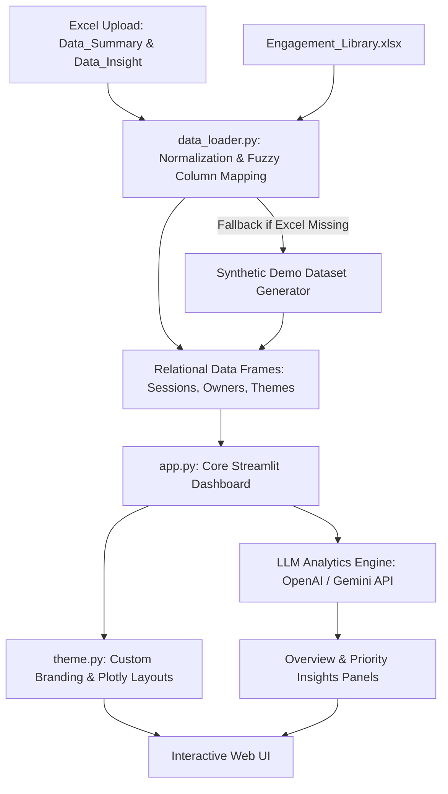

# Voice of Associates (VOA) Console
## People Analytics & Engagement Action Dashboard
**Author**: Amrit Raj Biswal (Tech Mahindra People Analytics & Systems Group)

> **Executive Brief**: An enterprise-grade, interactive analytics console built for HR Business Partners (HRBPs) and People Analytics teams to ingest, normalize, analyze, and manage employee connect sessions, priority risk items, and organizational action plans.

---

## 1. Executive Summary & Value Proposition

The **Voice of Associates (VOA)** Console is a web-based, interactive intelligence dashboard designed to solve the critical operational challenges of employee retention, engagement, and risk mitigation. By transforming unstructured, multi-format Excel spreadsheets from individual HR Connect sessions into clean, structured relational models, VOA enables:

*   **Real-time Risk Mapping**: Computes a dynamic composite **Risk Score (0–100)** for every connect session to instantly flag high-priority threats before they result in attrition.
*   **Thematic Trend Discovery**: Aggregates employee statements and observation notes into actionable themes, categorized under the proprietary **CARES Framework** (Alignment, Career, Empowerment, Recognition, Strive).
*   **Action Plan Accountability**: Tracks ownership workloads, open ticket velocity, and resolution progress through progress-tracked status columns.
*   **Generative AI-Driven Insights**: Leverages OpenAI and Google Gemini models to automatically summarize patterns, scan employee quotes, and generate executive summaries for leadership.

---

## 2. System Architecture & Data Flow

The application is structured into three clean, decoupled software layers: Ingestion/Normalization, Visual Console, and the Brand Design System.



### Component Directory
*   **[`app.py`](file:///c:/Users/profe/Downloads/HR%20P/app.py)**: The main execution script managing state, page routing (6 distinct tabs), widget filters, Plotly visualization pipelines, and LLM integrations.
*   **[`data_loader.py`](file:///c:/Users/profe/Downloads/HR%20P/data_loader.py)**: The data wrangling engine. Handles fuzzy header reconciliation, key mapping, secondary observation joins, and synthetic fallback generation.
*   **[`theme.py`](file:///c:/Users/profe/Downloads/HR%20P/theme.py)**: The design system registry. Contains hexadecimal color tokens, fluid CSS layouts, typography controls, and Javascript injection logic.

---

## 3. Data Normalization & Fuzzy Ingestion Pipeline

HR data is frequently gathered using varied Excel templates across different business units. The VOA ingestion engine is designed to handle this inconsistency robustly without breaking.

### Fuzzy Header Resolution
A built-in regex dictionary mapping target variables to multiple common spelling permutations:

| Target Field | Permutations & Regex Matches |
| :--- | :--- |
| **ID** | `\bid\b`, `connect.*id`, `session.*id` |
| **date** | `date.*connect`, `connect.*date`, `\bdate\b` |
| **associate_name** | `\bname\b`, `associate.*name`, `employee.*name` |
| **bhr_name_canonical** | `bhr.*name`, `name.*bhr`, `\bbhr\b` |
| **cares_lever** | `cares.*framework`, `cares.*lever`, `cares`, `framework` |
| **action_owners** | `action.*owner`, `owner.*action`, `assigned.*to`, `owners` |
| **coverage_item** | `coverage`, `item.*coverage`, `theme`, `insight` |

### Key Allocation & RDBMS Normalization
1. **Primary Keying**: The loader discards irregular source IDs and assigns a sequential, strict artificial primary key (`ID = 1, 2, 3...`) to guarantee uniqueness.
2. **Double-Lookup Mapping**: Connect observations often sit on a secondary sheet (`Data_Insight`). VOA links these back to parent sessions using a compound index search `(BHR ID/Name, Date)` combined with the original excel row ID.
3. **One-to-Many Decomposition**: Action owners and coverage items are flattened into clean long-format tables (`owners_long`, `coverage_long`) to facilitate fast SQL-style aggregation.

---

## 4. Mathematical Modeling: Composite Risk Score

A key differentiator of the VOA platform is its ability to prioritize attention. Rather than relying on simple subjective severity, the dashboard computes a composite **Risk Score (0–100)** for every connect session:

$$\text{Risk Score} = \text{Severity Weight} + \text{Status Weight} + \text{Sentiment Weight} + \text{Age Weight}$$

### Component Breakdown

1. **Severity Weight (Max: 45 pts)**:
   * **High**: $45\text{ pts}$
   * **Moderate**: $22\text{ pts}$
   * **Low**: $6\text{ pts}$
   * **Unspecified**: $10\text{ pts}$

2. **Status Weight (Max: 30 pts)**:
   * **Open / New**: $30\text{ pts}$
   * **In-progress / Active / Pending**: $14\text{ pts}$
   * **Closed / Resolved**: $0\text{ pts}$ (Resolving tickets wipes out status risk)

3. **Sentiment Weight (Max: 15 pts)**:
   * **Negative / Poor**: $15\text{ pts}$
   * **Mixed**: $8\text{ pts}$
   * **Neutral**: $3\text{ pts}$
   * **Positive / Good**: $0\text{ pts}$

4. **Age Penalty Weight (Max: 10 pts)**:
   * Applied only to *unresolved* (Open/In-progress) tickets.
   * Compounded linearly based on days elapsed since the session date:
     $$\text{Age Weight} = \min\left(10, \frac{\text{Days Since Connect}}{10}\right)$$

> [!NOTE]
> A session with **High** severity, **Open** status, **Negative** sentiment, and aged **45 days** will compute to:
> $$45 + 30 + 15 + 4.5 = 94.5 \rightarrow \mathbf{95}\text{ Risk Score}$$

---

## 5. Design System: Tech Mahindra Red Guidelines

To achieve maximum visual premium quality and consistent corporate identity, the user interface adheres strictly to **Tech Mahindra's official design language**, applying a **60-30-10 color distribution model**:

```
60% Warm Neutrals (Background surfaces, clarity, comfort)
██████████████████████████████ #F6F2EA | #EBE5DA

30% Anchors & Blueprint Tones (Headers, navigation sidebar, card borders)
████████████████ #0A0838 | #4A453D

10% Mahindra Red (Primary actions, alerts, priority markers, active status)
██████ #E31837
```

### Typography Scale
*   **Hero / Page Titles**: *Newsreader* (Serif), fluid clamp sizing (`1.5rem` to `1.85rem`) for high editorial impact.
*   **Body Copy**: *Inter* (Sans-serif) for high legibility on digital layouts.
*   **Data & Metrics**: *IBM Plex Mono* (Monospace) to align values and risk scores.

### Visual Styling Details
*   **Sidebar Styling**: Engineered with custom dark-navy backgrounds, text-wrapping labels, and clean input boxes. The native collapse chevron is hidden to establish a secure, static portal experience.
*   **Plotly Graphics**: Overridden with clean backgrounds (`plotly_white`), branded palettes (Gold, Sage, Amethyst, Coral), and matching typography to make reports slides-ready.
*   **Favicon Force-Injection**: Uses asynchronous, recurring JavaScript to inject the Tech Mahindra base64 logo directly into browser tabs, bypassing default web frameworks.

---

## 6. Functional Module Guide

The platform is divided into **six functional pages**, accessible via the sidebar navigation portal:

### 1. Overview Dashboard
*   **Core Metrics**: 6 high-level KPI cards reporting Total Sessions, Open Items, In-Progress Items, overall Closure Rate %, count of High Severity indicators, and count of active HR Business Partners.
*   **Insights Panel**: "Insights for people in a hurry" highlights critical findings such as resolution velocity gaps and department-specific risk hotspots.
*   **Interactive Visualizations**: Time-series charts tracking connects, donut charts for severity and sentiment distributions, and horizontal bar charts for service-line breakdowns.

### 2. Priority & Risk Analysis
*   **Aggregated Trends**: Histograms mapping risk score distributions alongside scatter plots tracking risk severity against ticket age.
*   **Owner Workloads**: Identifies resource bottlenecks by ranking action owners by volume of high-risk items.
*   **Risk Grid**: Interactive, progress-bar-equipped data grid allowing instant sorting of high-score issues.

### 3. Coverage & Themes
*   **Theme Frequency**: Visualizes the top $N$ engagement themes (e.g. "Workload balance", "Career clarity") with interactive slider adjustments.
*   **Framework Breakdown**: Donut chart detailing observations mapped against the 5 CARES levers.

### 4. Action Center
*   **Kanban Board Grid**: High-priority sessions organized side-by-side in Open, In-progress, and Closed columns with tooltips showing specific employee feedback quotes.
*   **Performance Metrics**: Grid showing count of assigned tickets and closure % for each HR owner.

### 5. Insight Library
*   **Standard Playbooks**: Searchable playbook of standard recommended actions, allowing HR leads to look up pre-approved resolutions for common friction points.

### 6. Data Explorer & Inspector
*   **Full Data View**: Table showing all session attributes with quick-search filters.
*   **Session Inspector Card**: Side-by-side split screen rendering all detail fields, coverage summaries, action plans, and comments for any selected associate record.
*   **Export**: Quick CSV downloader for direct integration with external reporting tools.

---

## 7. Configuration & Installation Guide

### Prerequisites
*   **Python**: Version 3.8 or higher.
*   **Package Dependencies**: Install the required libraries via terminal:
    ```bash
    pip install streamlit pandas plotly openpyxl
    ```

### Running Locally
1. Navigate to the project directory:
   ```bash
   cd "C:\Users\profe\Downloads\HR P"
   ```
2. Run the application:
   ```bash
   streamlit run app.py
   ```
3. Open your web browser and navigate to `http://localhost:8501`.

### Data Workbooks Setup
For automated data loading, structure your Excel spreadsheets as follows:
*   **File Name**: Place `HR_Dashboard_Final.xlsx` and `Engagement_Library.xlsx` directly into the project root.
*   **Dashboard Sheets**:
    *   `Data_Summary`: Main connect log containing associate names, BHR IDs, Dates, service lines, sentiment, status, queries, and action owners.
    *   `Data_Insight`: Observational sheet mapping specific coverage items, severity, and action plans back to the parent logs.
